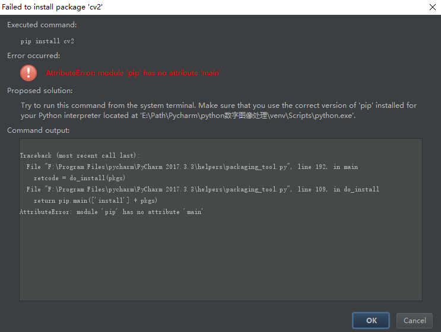
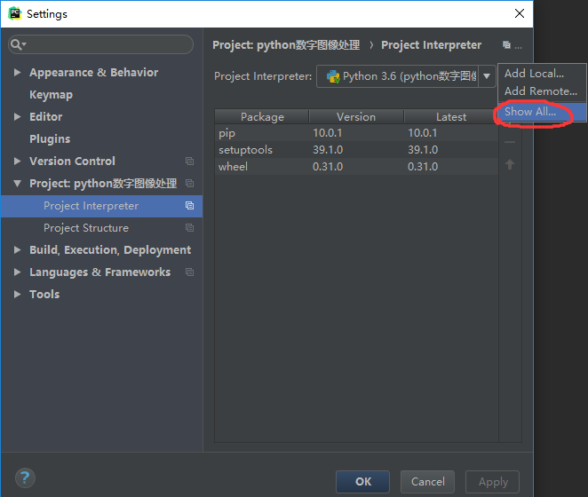
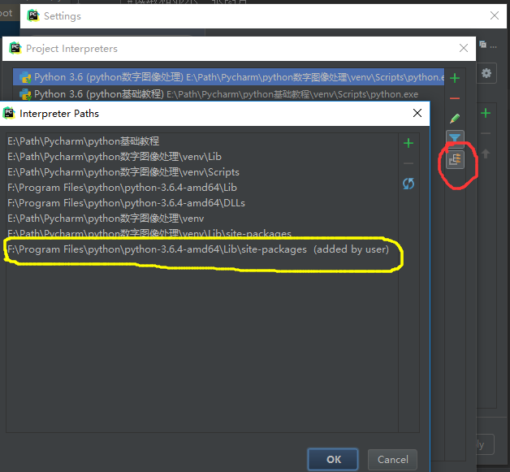
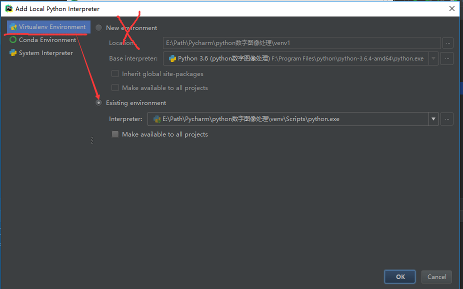
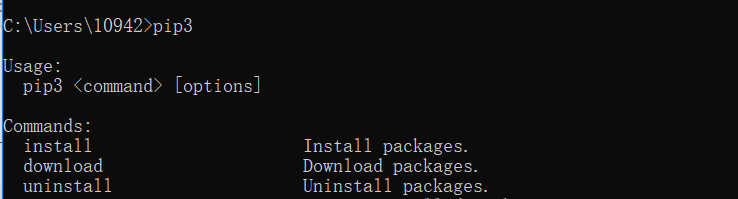
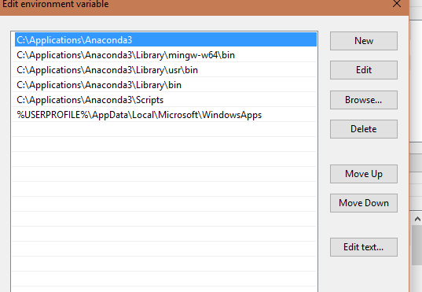

# solution

# win10 安装openCV和导入CV2

[win10 +python3.6环境下安装opencv以及pycharm导入cv2有问题的解决办法

**一、安装opencv**

　　借鉴的这篇博客已经写得很清楚了--------https://blog.csdn.net/u011321546/article/details/79499598       ，这里我只是记录一下自己的安装过程

　　按理说这里安装opencv应该有两种办法，一种方法是python的pip安装，另外一种方法是直接在Pycharm里安装，但是尝试后发现第二种方法发现有错，如下图。

　　

　　出错原因是“试着从系统终端运行这个命令”，所以我们只能用第一种方法pip安装。

　　**在安装opencv之前要先安装pip，安装pip方法如下：**

　　**进入Python安装目录下的Scripts路径，执行  easy_install-3.6.exe  pip**             （因为我的python版本是3.6的），执行了这条命令后，pip就安装成功了，pip的功能如下：

　　

 

　　**安装完pip后，接着安装opencv（其他模块安装也类似如下这种方法）：**

　　**进入Python安装目录下的Scripts路径，执行   pip install opencv-python** 

```
　　
　　这里要查看安装的opencv的版本话需要在，需要在命令行终端（或python自带的IDLE中）运行如下代码即可查看：
```

`　　`import cv2

　　cv2.__version__

　　效果如下，可以知道我的opencv版本为3.4.0

　　

 

 

**二、pycharm导入cv2有问题的解决办法**

　　pip安装好opencv后，可是在pycharm里导入cv2还是会报错，这是为什么呢？我也百度了好一会儿才找到解决方法，这里参考博客：https://blog.csdn.net/Eclipsesy/article/details/77686807      这篇博客很好解决了我的问题，但是博客里的方法最后一处感觉有点多余，只需要第一步即可解决问题。

　　**解决办法：**

　　要确定pycharm里的环境变量是否包含python的环境lib，查看方法如下图所示：



　　点击Show All，在点击红色圈查看pycahrm的查找路径，最后看黄色圈的路径是否加进去。注意：只有黄色圈部分路径加进去了（site-packages这个文件夹必须包含进去），Pycahrm才能正确导入cv2。



 

**补：pip安装成功第三方库后，pycharm导入第三方库却失败的解决办法**

　　可能是python虚拟环境要设置成存在的环境，而不是新产生的环境（我是在导入pywin32模块时始终无法导入，但是把这个虚拟环境改成已存在的环境后，Pycharm就可以成功导入pywin32模块了，真的是很神奇的一件事儿）

******


# win10下安装anaconda没有pip3

2019年05月22日 14:08:43 [假老练啊哦](https://me.csdn.net/qq_34269988) 阅读数 759


版权声明：本文为博主原创文章，遵循[ CC 4.0 by-sa ](http://creativecommons.org/licenses/by-sa/4.0/)版权协议，转载请附上原文出处链接和本声明。

本文链接：https://blog.csdn.net/qq_34269988/article/details/90437225

问题：新在win10下安装了annaconda没有pip3指令。

解决办法：

首先移动到anaconda下面的文件夹Scripts中，在cmd下输入：

```
cd C:\Users\10942\Anaconda3\Scripts
```

然后在执行如下指令：

```
easy_install.exe pip
```

之后就可以了，因为我安装anaconda的时候选择了添加路径，所以此时就不用再添加路径了，如果没添加的话还要手动添加。

可以使用了：




# Windows系统下手动设置Anaconda3环境变量

2018年03月22日 18:45:22 [lothakim](https://me.csdn.net/lothakim) 阅读数 14810 文章标签： [Anaconda3](https://so.csdn.net/so/search/s.do?q=Anaconda3&t=blog)


版权声明：本文为博主原创文章，遵循[ CC 4.0 by-sa ](http://creativecommons.org/licenses/by-sa/4.0/)版权协议，转载请附上原文出处链接和本声明。

本文链接：https://blog.csdn.net/lothakim/article/details/79658003

Windows下anaconda3的安装非常简单，但安装程序却有一个大坑，默认不会把anaconda写入环境变量路径，这就导致我们在命令行中输入诸如 ***conda list*** 之类的命令时，会报错。这就需要我们手动设置环境变量了。

关于Windows下的环境变量设置，官方文档里似乎也没有，百度的某些教程提供的路径都不完整，仍然会使 **conda**  命令报错。（我也是服了写这些教程的人，你们能不能自己测试好再发，发个不完整的出来，是在浪费浏览者的时间好吗？）

为此我特意重装了anaconda3并且选择默认写入环境变量，现在给大家提供一个完整的路径，亲测绝对有效：



其中Anaconda3前面的路径视实际安装路径而定。

配置好后再使用 ***conda*** 命令就不会报错了。


# CUDA安装失败的解决经验

2019年02月18日 15:43:29   

分类专栏： [# 软件安装](https://blog.csdn.net/jasmine_z_s/article/category/8678367)


版权声明：本文为博主原创文章，遵循[ CC 4.0 by-sa ](http://creativecommons.org/licenses/by-sa/4.0/)版权协议，转载请附上原文出处链接和本声明。本文链接：https://blog.csdn.net/Jasmine_z_s/article/details/87622371

CUDA安装失败的解决经验

# 超简单的CUDA安装失败解决办法

**写在最前面：我没有安装vs2013，而是直接按照本文进行自定义安装，去掉vs前的勾，安装成功**


重装了win10系统，想搭建Anaconda3+Pycharm+TensorFlow的环境，因为显卡是NVIDIA GeForce GTX1050的，所以打算安装GPU版本的TensorFlow。在安装TensorFlow之前我安装了 **cuda_9.0.176**，全都点击下一步完成的，结果报错了。我用了很简单的办法解决了：先安装**Visual Studio 2013**，再安装cuda，并在安装过程中取消掉VS前的√即可，具体操作如下：

## 一、安装Visual Studio 2013

下载了两个安装包，先安第一个，再安第二个，没有特别的注意事项。


1. **安装vs_community** ，期间报了一个错误但是没什么影响。
   
   
2. 安装 **vs_langpack**
   

## 二、安装CUDA


文件路径你自己选择，我是选的默认路径，在此就不展示图片了。

## 重点是以下的勾选

取消掉CUDA里Visual Studio Integration前的√（我安装的时候忘截图了，从网上找了一张，版本不一致，但是操作是一样的）。

然后就一步步点下去，就安装成功了（这是我自己的图片）。


# CUDA安装失败解决方法

2018年05月11日 17:31:57  更多


版权声明：本文为博主原创文章，遵循[ CC 4.0 by-sa ](http://creativecommons.org/licenses/by-sa/4.0/)版权协议，转载请附上原文出处链接和本声明。本文链接：https://blog.csdn.net/zzpong/article/details/80282814

## CUDA安装失败原因

一般CUDA安装失败都是由于其中Visual Studio(VS) Intergration无法安装导致的： 
 
当然可以通过自定义的方式取消Visual Studio Intergration进行安装， 
 
 
然后再重新用CUDA安装程序将Visual Studio Intergration单独装上去，不过这种方法成功概率不大。并且随之而来的问题就是在Visual Studio编译时会报错，比如我所使用的VS2015出现了如下错误“未找到导入的项目“**C:\Program Files (x86)\MSBuild\Microsoft.Cpp\v4.0\V140\BuildCustomizations**\CUDA 8.0.props”。请确认<Import> 声明中的路径正确，且磁盘上存在该文件。”

## 解决方法

### 基础篇

**基础篇用于解决编译问题，完成这一部分即可保证CUDA程序正常运行。**

首先请按照 
 
的选择项自定义安装CUDA，并记下你所释放安装程序的路径，比如我的是“**D:\Download\test**”： 
 
然后**在安装CUDA的时候**，将“**D:\Download\test**”路径下的CUDAVisualStudioIntegration文件夹拷到其他位置保存，这里记作“**dir**\CUDAVisualStudioIntegration”,**dir**为你拷贝文件所在路径。该文件夹所含文件如下图示： 
 
随后等待CUDA安装完成后点击确认。 
之后，请运行VS，编译CUDA Samples工程（“**C:\ProgramData\NVIDIA Corporation**\CUDA Samples”），并找到VS报错路径，比如我的是“**C:\Program Files (x86)\MSBuild\Microsoft.Cpp\v4.0\V140\BuildCustomizations**\CUDA 8.0.props”，并将“**dir**\CUDAVisualStudioIntegration\extras\visual_studio_integration\MSBuildExtensions”中的所有文件拷贝到“**C:\Program Files (x86)\MSBuild\Microsoft.Cpp\v4.0\V140\BuildCustomizations**”文件夹中。 
重启VS，即可解决问题。

### 进阶篇

**进阶篇可实现VS中直接新建CUDA解决方案的功能。**

我们发现，虽然上述VS已可以正常编译，但毕竟不是完整安装CUDA，因此缺失了VS中“新建CUDA解决方案”的功能，如图： 

这时候只需要将“**dir**\CUDAVisualStudioIntegration\extras\visual_studio_integration”下的CudaProjectVsWizards文件夹整体拷贝到“**D:\ProgramFiles\Microsoft Visual Studio 14.0**\Common7\IDE\Extensions”下即可，其中加粗部分为VS安装路径。重启VS，问题解决： 

最后的最后，还可以把“**dir**\CUDAVisualStudioIntegration”下的NVIDIA_Nsight_Visual_Studio_Edition_Win64_5.2.0.16321安装一下，它是CUDA给VS2015提供的一个调试插件。

------

Tips： 
\1. 请注意**文中所述路径并不一定是你所需要的路径**，而所需路径的寻找方法已在文中给出，请仔细阅读； 
\2. 至于CUDAVisualStudioIntegration文件夹下的其他文件，我就不知道是做什么用的了，至少目前运行TensorFlow一切正常。并且毕竟刚开始接触这些东西，残存的一些文件归属问题就等熟练了之后再做处理吧。


---------

----------

-----


# 如何查看已安装的tensorflow的版本和位置

2019年06月01日 14:13:35 [Rolla_](https://me.csdn.net/weixin_42578378) 阅读数 600


版权声明：本文为博主原创文章，遵循[ CC 4.0 by-sa ](http://creativecommons.org/licenses/by-sa/4.0/)版权协议，转载请附上原文出处链接和本声明。

本文链接：https://blog.csdn.net/weixin_42578378/article/details/90728713

1、在命令行中进入python

2、输入 `import tensorflow as tf`

3、待执行完上述语句后，输入 `tf.__version__`
这是查找版本号（注意，此处version的左右各有两个下划线）

4、输入`tf.__path__`，查找安装位置


# win10 卸载cuda

2018年12月17日 18:55:15 [mjiansun](https://me.csdn.net/u013066730) 阅读数 5643


## 1.首先

对于cuda8.0、cuda7.5的卸载都可以兼容
安装cuda9.0之后，电脑原来的NVIDIA图形驱动会被更新，NVIDIA Physx系统软件也会被更新(安装低版cuda可能不会被更新)。卸载时候要注意了，别动这2个。

## 2.卸载

### 1.前言

杀毒软件别用来卸载这个了，不好找。
打开电脑的控制面板，找到程序，卸载程序
点击当天安装的时间，会找到刚才装的cuda软件，也包括以前NVIDIA的驱动软件，因为被更新了，所以也显示在当天安装的软件中。

### 2.卸载开始

对于含cuda字眼的，和结尾版本号是9.0的可以卸载。
如果不确定那个程序能不能删除，可以搜索试试看，程序什么用途的。
NVIDIA的软件一个个都有其独立卸载程序，不用担心卸载顺序。
**具体的：**
**1.留下：**NVIDIA的图形驱动程序、NVIDIA Physx系统软件，如果你有这2个软件，就别卸载。
**2.卸载：** 
1.推荐排序。 点击顶部时间小三角排序，可发现一个叫NVIDIA Nsight HUD Launcher 的带眼睛图标的排列在上面，挺大的。然后从下往上卸载，跳过保留的NVIDIA图形驱动、NVIDIA Physx系统软件。
2.软件名含cuda的，9.0的，sdk，NVIDIA Nsight HUD、NVIDIA GeForce Experience、等，这些都可以卸载掉。
3.卸载完后，你会发现电脑—开始—所有程序，里面那个关于NVIDIA的程序文件不见了。存在的话，也可以看看里面还剩下什么，可以搜索看看。当然，C盘里面C:\Program Files\NVIDIA GPU Computing Toolkit文件也可以删除了。
4.用杀毒软件垃圾扫描下，清理下电脑，主要是清理注册表
——————————-卸载就到此结束————————-

### 3.继续安装cuda8.0

2017-12的时候，tensorflow 1.4不支持cuda9.0，且tensorflow1.0版本以上是不支持cuda8.0以下的,所以暂时只能装cuda8.0。
cuda8.0对应的cuDNN必须是6.0版的。
cuda8.0，在cuda下载页面，Legacy Releases，找到旧版本下载地址，然后下载安装
最后成功安装，选择CUDA Toolkit 8.0 GA2 + cuDNN v6.0 (April 27, 2017) for CUDA 8.0
可以在python里面，import tensorflow as tf 再输入tf.Session()，查看是不是用的gpu加速

[在windows查看*CUDA*、cudnn 版本以及*卸载*](https://blog.csdn.net/miaogegegege/article/details/85230615)

---------

----------

----------

